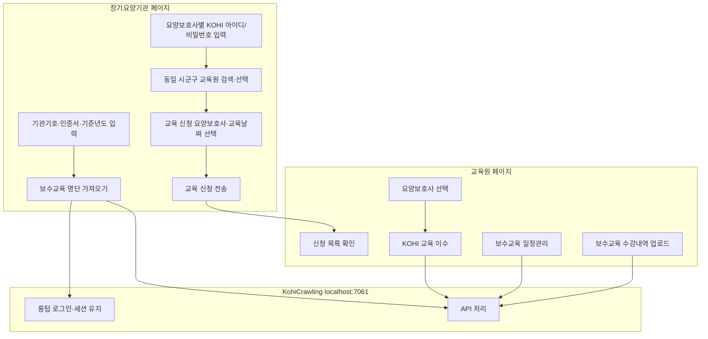

# KohiCrawling 서비스 개요

## 프로그램이란

**KohiCrawling(롱텀 크롤링 프로그램)** 은 교육원 또는 장기요양기관의 **롱텀(longtermcare.or.kr) 로그인 정보**를 이용해, 보수교육 관련 정보를 자동 입력하거나 세션을 통해 정보를 조회하는 로컬 자동화 프로그램입니다.

추가로 **KOHI 온라인 교육 자동 이수** 기능을 제공합니다.

프로그램을 실행하면 로컬 **`http://localhost:7061`** 포트에 백엔드 HTTP 서버가 열리며, 별도 프론트엔드(교육원용·장기요양기관용 페이지)가 이 서버의 API를 호출해 동작합니다.

> API 엔드포인트 상세는 [API_SPEC.md](./API_SPEC.md)를 참고하세요.

---

## 역할 구분

| 구분 | 롱텀 로그인 유형 | 주요 용도 |
|------|------------------|-----------|
| **장기요양기관** | 장기요양기관 | 보수교육 대상 명단 조회 |
| **교육원** | 보수교육기관 | 일정 등록, 수강내역 업로드, (교육원 측) 수강내역 조회 |
| **KOHI** | KOHI 계정 | 온라인 교육 자동 이수 |

---

## 전체 흐름

---

## 장기요양기관용 페이지

장기요양기관용 페이지는 **롱텀 로그인 없이** 사용합니다.  
대신 사용자가 입력한 기관 정보를 백엔드에 전달하고, 백엔드가 롱텀에 대신 로그인·조회합니다.

### 1. 보수교육 명단 가져오기

사용자 입력:

- 기관기호 (`institutionCode`)
- 인증서명 (`certName`)
- 인증서 비밀번호 (`certPassword`)
- 기준년도 (`educationYear`)

**[보수교육 명단 가져오기]** 버튼 클릭 시:

1. 백엔드가 롱텀에 **장기요양기관** 계정으로 자동 로그인
2. 기준년도 기준 보수교육 대상 요양보호사 정보 조회
3. 결과를 프론트에 반환

연동 API: `POST /api/longterm/enrollLoad/longterm`

### 2. 보수교육 대상 조건

기준년도 기준으로 아래 조건을 **모두** 만족하는 요양보호사만 포함합니다.

| # | 조건 |
|---|------|
| 1 | **기준년도**와 **출생년도(BDAY)** 가 둘 다 짝수이거나, 둘 다 홀수 |
| 2 | **입사일(ENTCO_DT)** 이 기준년도 **10월 31일 이전** (11월 1일 이후 입사자 제외) |
| 3 | **자격증 취득년도(FST_GRANT_DT)** 가 기준년도 또는 직전 연도가 **아님** (취득 후 2년 경과에 해당) |

추가로 `FNM` + `BDAY`가 동일한 중복 행은 제거합니다.

### 3. 교육 신청 준비

명단을 가져온 뒤, 각 요양보호사에 대해:

- **KOHI 아이디**
- **KOHI 비밀번호**

를 입력할 수 있어야 합니다. (이후 교육원에서 KOHI 자동 이수에 사용)

### 4. 교육원 검색 및 교육 신청

1. 장기요양기관 **주소지와 같은 시·군·구**에 있는 교육원 검색
2. 검색된 교육원 목록에서 **교육을 신청할 교육원** 선택
3. 교육을 신청할 **요양보호사** 선택
4. **교육 날짜** 선택
5. 전송

> 교육원 검색·교육 신청 전송 API는 **아직 미구현**입니다. 프론트 UI 및 백엔드 설계가 필요합니다.

---

## 교육원용 페이지

교육원도 KohiCrawling 프로그램을 실행한 PC에서 동작합니다.  
롱텀·KOHI 작업은 백엔드가 브라우저 자동화로 처리합니다.

### 1. 장기요양기관 신청 확인

장기요양기관에서 전송한 **기관·요양보호사·교육일** 신청 목록을 확인합니다.

> 신청 목록 저장·조회 방식(로컬 DB, 파일, 외부 서버 등)은 **아직 미정**입니다.

### 2. KOHI 교육 자동 이수

1. 신청된 요양보호사(또는 목록에서) 대상 선택
2. **[KOHI 교육 이수]** 버튼 클릭
3. 입력된 KOHI 아이디·비밀번호로 로그인 후 온라인 교육 자동 진행

연동 API: `POST /api/kohi/autoLearn`

### 3. 보수교육 일정관리 자동 입력

교육원이 롱텀 **보수교육기관** 계정으로 로그인해 대면 교육 일정을 자동 등록합니다.

연동 API: `POST /api/longterm/schedule`

### 4. 보수교육 수강내역 자동 업로드

교육원이 롱텀에 수강내역 엑셀을 자동 업로드합니다.  
바탕화면에 **「보수교육 수강내역 등록」** 이 포함된 파일명의 엑셀을 두면 해당 파일을 선택합니다.

연동 API: `POST /api/longterm/enrollUpload`

### 5. (교육원) 수강내역 조회

교육원 계정으로 이미 등록된 수강내역을 조회할 때 사용합니다.

연동 API: `POST /api/longterm/enrollLoad/edu`

---

## 미정 사항

### KOHI 강의명을 누가 선택하는가?

온라인 교육 자동 이수(`autoLearn`)에는 **강의명(`courseName`) 목록**이 필요합니다.

| 후보 | 설명 |
|------|------|
| **장기요양기관** | 교육 신청 단계에서 기관이 강의까지 지정 |
| **교육원** | 신청 접수 후 교육원이 이수할 강의를 지정 |

**아직 정해지지 않았습니다.**  
결정에 따라 프론트 입력 UI와 API 요청 본문 설계가 달라집니다.

---

## 백엔드 동작 특성

- 작업 완료까지 HTTP 연결을 유지하고 **성공/실패 결과**를 JSON으로 반환합니다.
- 롱텀·KOHI 브라우저 세션은 작업 후 **유지**되며, **동일 계정** 재요청 시 재로그인을 생략합니다.
- 계정(또는 롱텀 로그인 유형)이 바뀌면 브라우저를 닫고 처음부터 다시 시작합니다.
- 같은 그룹(롱텀 / KOHI) 내 동시 요청은 한 번에 하나만 처리됩니다.

---

## 기능·API 매핑

| 화면 기능 (가칭) | 사용자 | API | 구현 |
|------------------|--------|-----|------|
| 보수교육 명단 가져오기 | 장기요양기관 | `POST /api/longterm/enrollLoad/longterm` | ✅ |
| KOHI 교육 이수 | 교육원 | `POST /api/kohi/autoLearn` | ✅ |
| 보수교육 일정관리 | 교육원 | `POST /api/longterm/schedule` | ✅ |
| 보수교육 수강내역 업로드 | 교육원 | `POST /api/longterm/enrollUpload` | 🔶 부분 |
| 수강내역 조회 (교육원) | 교육원 | `POST /api/longterm/enrollLoad/edu` | ✅ |
| 교육원 검색 | 장기요양기관 | — | ❌ |
| 교육 신청 전송 | 장기요양기관 | — | ❌ |
| 신청 목록 확인 | 교육원 | — | ❌ |

---

## 관련 문서

- [API_SPEC.md](./API_SPEC.md) — HTTP API 요청·응답 명세
